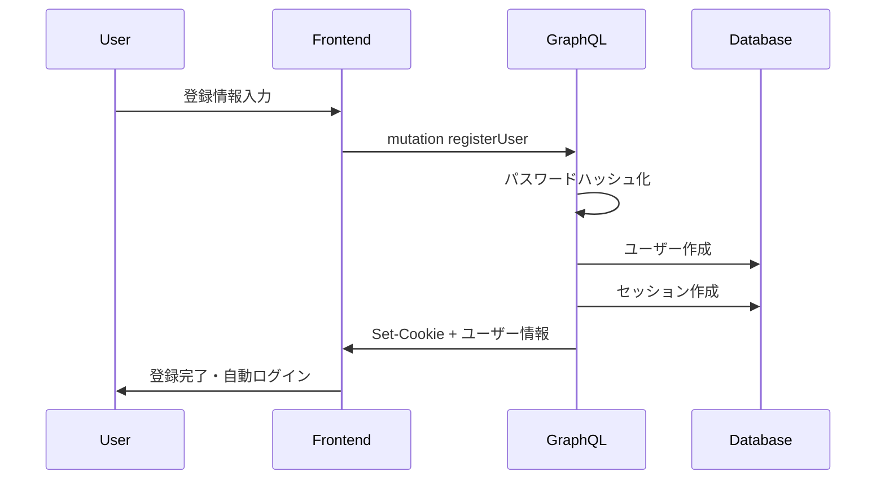
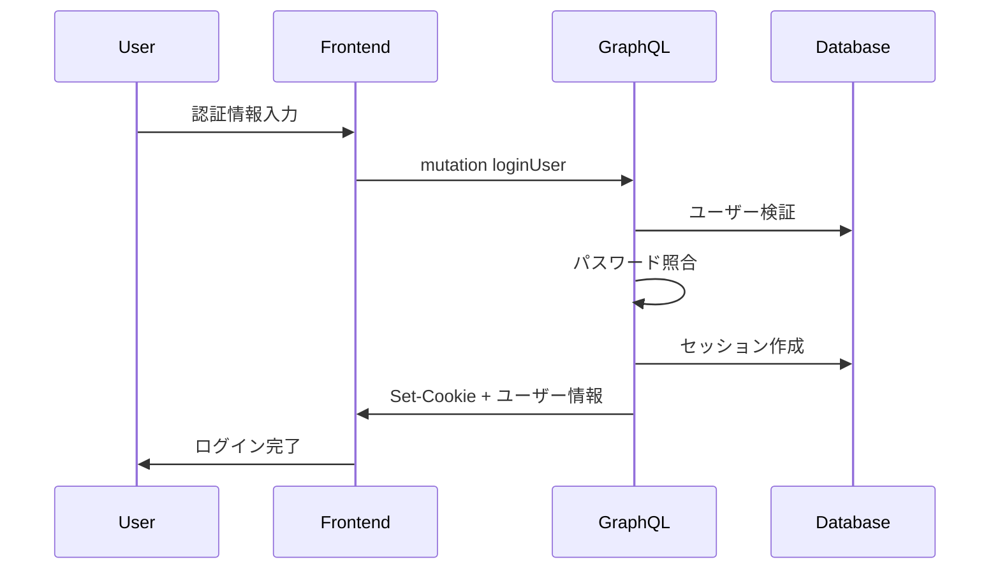
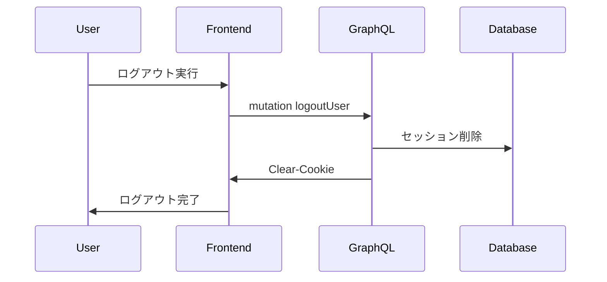

# 🔐 認証アーキテクチャ仕様

**JWT + CSRF認証システム** による、セキュアで使いやすい認証システムの設計・実装ガイド。

---

## 🏗️ アーキテクチャ概要

### 設計思想
- **JWT認証**: ステートレス認証 + CSRFプロテクション
- **GraphQL統合**: シームレスな認証状態管理
- **セキュリティ重視**: CSRF対策・トークン管理・権限制御

### 技術選択の理由
| 方式 | 採用理由 | 特徴 |
|------|----------|------|
| **JWT認証** | ✅ ステートレス<br>✅ スケーラビリティ<br>✅ クライアント管理 | 15分短期トークン |
| **CSRF保護** | ✅ XSS攻撃対策<br>✅ Double Submit Cookie | セキュアトークン検証 |
| **Prisma統合** | ✅ 型安全<br>✅ 簡潔なDB操作 | ユーザー管理の簡素化 |

---

## 🔄 認証フロー

### 1. ユーザー登録フロー


### 2. ログインフロー


### 3. ログアウトフロー


---

## 🛠️ 実装詳細

### データベーススキーマ
```prisma
// prisma/schema.prisma
model User {
  id            String    @id @default(cuid())
  email         String    @unique
  passwordHash  String
  name          String
  role          UserRole  @default(USER)
  introduction  String?
  createdAt     DateTime  @default(now())
  updatedAt     DateTime  @updatedAt
  
  @@map("users")
}

model PasswordResetToken {
  id        String   @id @default(cuid())
  token     String   @unique
  userId    String
  expiresAt DateTime
  used      Boolean  @default(false)
  createdAt DateTime @default(now())
  
  user      User     @relation(fields: [userId], references: [id], onDelete: Cascade)
  
  @@map("password_reset_tokens")
}

enum UserRole {
  USER
  ADMIN
  MODERATOR
}
```

### JWT認証コンテキスト
```typescript
// server/graphql/types/auth.ts
import jwt from 'jsonwebtoken';
import { prisma } from '../db';

export interface AuthContext {
  userId?: string;
  user?: User;
  isAuthenticated: boolean;
}

export const getAuthContext = async (req: NextApiRequest): Promise<AuthContext> => {
  const token = req.cookies['auth-token'] || req.headers.authorization?.replace('Bearer ', '');
  
  if (!token) {
    return { isAuthenticated: false };
  }

  try {
    const decoded = jwt.verify(token, process.env.JWT_SECRET!) as { userId: string };
    
    const user = await prisma.user.findUnique({
      where: { id: decoded.userId },
    });

    if (!user) {
      return { isAuthenticated: false };
    }

    return {
      userId: user.id,
      user,
      isAuthenticated: true,
    };
  } catch (error) {
    console.error('JWT verification failed:', error);
    return { isAuthenticated: false };
  }
};
```

### 認証ミューテーション
```typescript
// server/graphql/types/mutations/users.ts
import jwt from 'jsonwebtoken';
import bcrypt from 'bcryptjs';

builder.mutationField('loginUser', (t) =>
  t.field({
    type: AuthResult,
    args: {
      email: t.arg.string({ required: true }),
      password: t.arg.string({ required: true }),
    },
    resolve: async (_, args, { req, res }) => {
      // 1. ユーザー検証
      const user = await prisma.user.findUnique({
        where: { email: args.email }
      });

      if (!user) {
        throw new Error('Invalid credentials');
      }

      // 2. パスワード照合
      const isValid = await bcrypt.compare(args.password, user.passwordHash);
      if (!isValid) {
        throw new Error('Invalid credentials');
      }

      // 3. JWTトークン生成
      const token = jwt.sign(
        { userId: user.id },
        process.env.JWT_SECRET!,
        { expiresIn: '15m' }
      );

      // 4. HTTPOnlyクッキー設定
      res.setHeader('Set-Cookie', cookie.serialize('auth-token', token, {
        httpOnly: true,
        secure: process.env.NODE_ENV === 'production',
        sameSite: 'strict',
        maxAge: 15 * 60, // 15分
        path: '/',
      }));

      return {
        success: true,
        user,
        token,
        message: 'Login successful',
      };
    },
  })
);

builder.mutationField('logoutUser', (t) =>
  t.field({
    type: 'Boolean',
    authScopes: { isAuthenticated: true },
    resolve: async (_, __, { req, res }) => {
      // クッキー削除
      res.setHeader('Set-Cookie', cookie.serialize('auth-token', '', {
        httpOnly: true,
        secure: process.env.NODE_ENV === 'production',
        sameSite: 'strict',
        expires: new Date(0),
        path: '/',
      }));

      return true;
    },
  })
);
```

---

## 🔒 セキュリティ実装

### CSRF保護
```typescript
// server/graphql/types/consts.ts
export const CSRF_TOKEN_HEADER = 'x-csrf-token';

// CSRFトークン発行
builder.mutationField('issueCsrfToken', (t) =>
  t.string({
    authScopes: { isAuthenticated: true },
    resolve: async (_, __, { auth, res }) => {
      const token = crypto.randomBytes(32).toString('hex');
      
      // セッションとCSRFトークンを関連付け
      await prisma.session.update({
        where: { id: auth!.sessionId },
        data: { csrfToken: token },
      });

      return token;
    },
  })
);

### CSRF検証ミドルウェア
export const validateCSRF = async (req: NextApiRequest, auth: AuthContext) => {
  if (req.method !== 'POST') return true;

  const tokenFromHeader = req.headers['x-csrf-token'] as string;
  const tokenFromCookie = req.cookies['csrf-token'];
  
  if (!tokenFromHeader || !tokenFromCookie) {
    throw new Error('CSRF token required');
  }

  if (tokenFromHeader !== tokenFromCookie) {
    throw new Error('Invalid CSRF token');
  }

  return true;
};
```

### パスワードセキュリティ
```typescript
// lib/password.ts
import bcrypt from 'bcryptjs';
import zxcvbn from 'zxcvbn';

export const hashPassword = async (password: string): Promise<string> => {
  const saltRounds = 12;
  return bcrypt.hash(password, saltRounds);
};

export const verifyPassword = async (password: string, hash: string): Promise<boolean> => {
  return bcrypt.compare(password, hash);
};

export const validatePasswordStrength = (password: string) => {
  const result = zxcvbn(password);
  
  if (result.score < 3) {
    throw new Error(`パスワードが弱すぎます: ${result.feedback.suggestions.join(', ')}`);
  }
  
  return true;
};

// 使用例
builder.mutationField('registerUser', (t) =>
  t.field({
    type: AuthResult,
    args: {
      email: t.arg.string({ required: true }),
      password: t.arg.string({ required: true }),
      name: t.arg.string({ required: true }),
    },
    resolve: async (_, args) => {
      // パスワード強度検証
      validatePasswordStrength(args.password);
      
      // ハッシュ化して保存
      const passwordHash = await hashPassword(args.password);
      
      const user = await prisma.user.create({
        data: {
          email: args.email,
          passwordHash,
          name: args.name,
        },
      });

      // ... セッション作成処理
    },
  })
);
```

### トークン管理
```typescript
// lib/jwt.ts
import jwt from 'jsonwebtoken';

export const JWT_EXPIRES_IN = '15m'; // 15分の短期トークン

export const generateToken = (userId: string): string => {
  return jwt.sign({ userId }, process.env.JWT_SECRET!, {
    expiresIn: JWT_EXPIRES_IN,
  });
};

export const verifyToken = (token: string): { userId: string } | null => {
  try {
    return jwt.verify(token, process.env.JWT_SECRET!) as { userId: string };
  } catch (error) {
    return null;
  }
};

// トークン自動リフレッシュ（フロントエンド）
export const setupTokenRefresh = () => {
  setInterval(async () => {
    try {
      const response = await fetch('/api/auth/refresh', {
        method: 'POST',
        credentials: 'include',
      });
      
      if (response.ok) {
        console.log('Token refreshed');
      }
    } catch (error) {
      console.error('Token refresh failed:', error);
    }
  }, 10 * 60 * 1000); // 10分ごとにリフレッシュ
};
```

---

## 🎯 認証スコープ設定

### Pothosスコープ定義
```typescript
// server/graphql/builder.ts
import SchemaBuilder from '@pothos/core';

export const builder = new SchemaBuilder<{
  AuthScopes: {
    public: boolean;
    isAuthenticated: boolean;
    isAdmin: boolean;
    isModerator: boolean;
    isOwner: { userId: string };
  };
  Context: {
    req: NextApiRequest;
    res: NextApiResponse;
    auth: AuthContext;
  };
}>({
  authScopes: async (context) => ({
    public: true,
    isAuthenticated: !!context.auth.user,
    isAdmin: context.auth.user?.role === 'ADMIN',
    isModerator: ['ADMIN', 'MODERATOR'].includes(context.auth.user?.role || ''),
    isOwner: ({ userId }) => context.auth.userId === userId,
  }),
});
```

### スコープ適用例
```typescript
// 認証不要（パブリック）
builder.queryField('artworks', (t) =>
  t.prismaField({
    type: ['Artwork'],
    authScopes: { public: true },
    resolve: (query) => prisma.artwork.findMany({ ...query }),
  })
);

// ログイン必須
builder.mutationField('updateProfile', (t) =>
  t.prismaField({
    type: 'User',
    authScopes: { isAuthenticated: true },
    args: { name: t.arg.string() },
    resolve: async (query, _, args, { auth }) => {
      return prisma.user.update({
        ...query,
        where: { id: auth!.userId },
        data: args,
      });
    },
  })
);

// 管理者のみ
builder.mutationField('deleteUser', (t) =>
  t.boolean({
    authScopes: { isAdmin: true },
    args: { userId: t.arg.string({ required: true }) },
    resolve: async (_, args) => {
      await prisma.user.delete({ where: { id: args.userId } });
      return true;
    },
  })
);

// オーナーのみ
builder.mutationField('deleteArtwork', (t) =>
  t.boolean({
    authScopes: (_, args, { auth }) => ({ isOwner: { userId: args.userId } }),
    args: { artworkId: t.arg.string({ required: true }) },
    resolve: async (_, args) => {
      await prisma.artwork.delete({ where: { id: args.artworkId } });
      return true;
    },
  })
);
```

---

## 🔧 フロントエンド統合

### AuthContext基本構造
```typescript
// contexts/AuthContexts.tsx
interface AuthUser {
  id: string;
  name: string;
  email: string;
  role: 'USER' | 'ADMIN' | 'MODERATOR';
}

interface AuthContextType {
  user: AuthUser | null;
  loading: boolean;
  login: (email: string, password: string) => Promise<void>;
  logout: () => Promise<void>;
  isAuthenticated: boolean;
  isAdmin: boolean;
}

export const useAuth = () => {
  const context = useContext(AuthContext);
  if (!context) {
    throw new Error('useAuth must be used within AuthProvider');
  }
  return context;
};
```

### 基本的な認証フロー
```typescript
// JWT トークンのクライアント側管理
const login = async (email: string, password: string) => {
  const result = await loginMutation({ email, password });
  if (result.error) {
    throw new Error(result.error.message);
  }
  // JWTはHTTPOnlyクッキーで自動管理
  refetchUser({ requestPolicy: 'network-only' });
};

const logout = async () => {
  await logoutMutation({});
  refetchUser({ requestPolicy: 'network-only' });
};
```

---

## 🧪 テスト戦略

### 認証フロー基本テスト
```typescript
// __tests__/auth/authentication.test.ts
describe('Authentication Flow', () => {
  it('正常なログインフローが動作する', async () => {
    const loginResult = await testClient.mutation(LoginUserDocument, {
      email: 'test@example.com',
      password: 'testpassword123',
    });

    expect(loginResult.data?.loginUser.success).toBe(true);
  });

  it('無効な認証情報でログインが失敗する', async () => {
    const result = await testClient.mutation(LoginUserDocument, {
      email: 'test@example.com',
      password: 'wrongpassword',
    });

    expect(result.errors).toBeDefined();
  });
});
```

### 認証ガードテスト
```typescript
// 管理者のみアクセス可能なページのテスト
it('管理者でない場合はアクセス拒否', async () => {
  const result = await testClient.query(AdminOnlyQuery);
  expect(result.errors?.[0].message).toContain('Forbidden');
});
```

---

## 🔄 パスワードリセット機能

### 基本実装
```typescript
// パスワードリセット要求
builder.mutationField('requestPasswordReset', (t) =>
  t.boolean({
    args: { email: t.arg.string({ required: true }) },
    resolve: async (_, args) => {
      const user = await prisma.user.findUnique({
        where: { email: args.email },
      });

      if (!user) {
        // セキュリティ上、存在しないメールアドレスでも成功を返す
        return true;
      }

      // トークン生成・メール送信処理
      const token = crypto.randomBytes(32).toString('hex');
      await prisma.passwordResetToken.create({
        data: {
          token,
          userId: user.id,
          expiresAt: new Date(Date.now() + 24 * 60 * 60 * 1000), // 24時間
        },
      });

      // メール送信（実装詳細は省略）
      await sendPasswordResetEmail(user.email, token);
      return true;
    },
  })
);
```

---

## 🔄 今後の拡張予定

### 短期実装予定
- [ ] **トークンリフレッシュ**: 自動トークン更新機能
- [ ] **多要素認証準備**: TOTP対応の基盤整備
- [ ] **セキュリティ強化**: レート制限・ブルートフォース対策

### 中期拡張予定
- [ ] **OAuth統合**: Google・GitHub ログイン
- [ ] **セッション管理**: 複数デバイス・ログイン履歴
- [ ] **監査ログ**: 認証イベント追跡

### 長期改善予定
- [ ] **Zero-Knowledge**: パスワードレス認証検討
- [ ] **SSO統合**: エンタープライズ向け認証
- [ ] **生体認証**: WebAuthn対応

---

## 📚 関連ドキュメント

- **[バックエンド仕様](backend.md)**: GraphQL実装・API設計
- **[フロントエンド仕様](frontend.md)**: React・認証UI実装
- **[デプロイメント](deployment-controls.md)**: 本番環境セキュリティ設定

---

<div align="center">

**最終更新**: 2025-09-07  
**管理者**: Security Team

</div>
