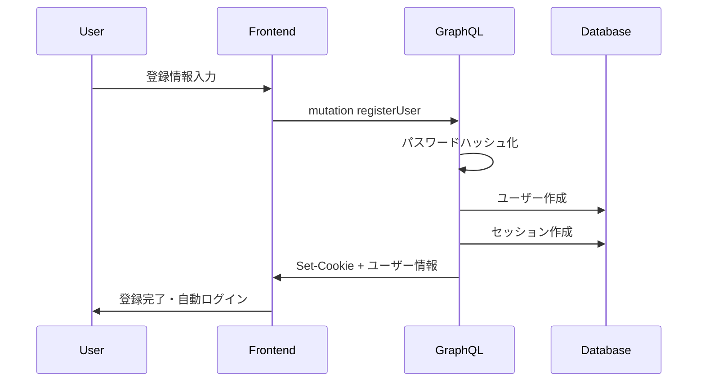
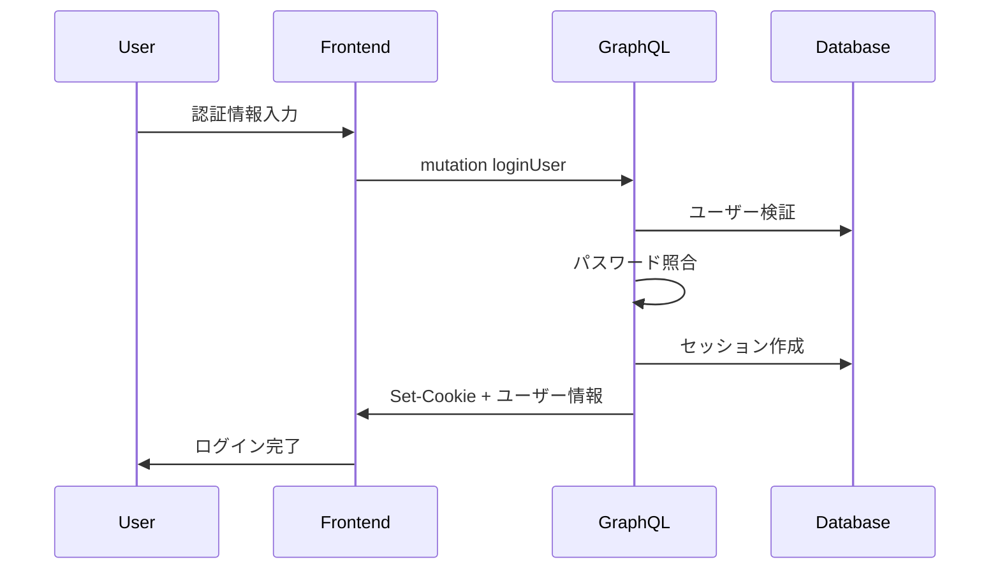
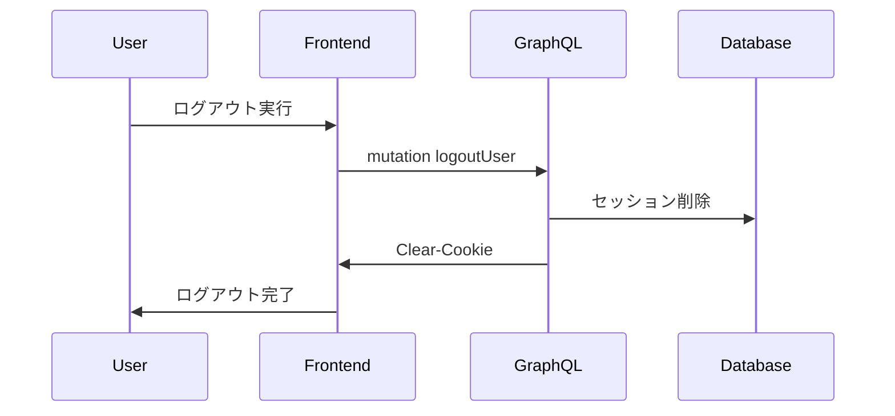

# 🔐 認証アーキテクチャ仕様

**Cookie-based Session Authentication** による、セキュアで使いやすい認証システムの設計・実装ガイド。

---

## 🏗️ アーキテクチャ概要

### 設計思想
- **Stateful認証**: サーバーサイドセッション + HTTPSセキュアCookie
- **GraphQL統合**: シームレスな認証状態管理
- **セキュリティ重視**: CSRF対策・セッション管理・権限制御

### 技術選択の理由
| 方式 | 採用理由 | 代替案 |
|------|----------|--------|
| **Cookie認証** | ✅ CSRF対策が容易<br>✅ ブラウザ自動管理<br>✅ セッション無効化対応 | JWT (Token管理複雑) |
| **Prisma Session** | ✅ DB統合管理<br>✅ 型安全<br>✅ 複数デバイス対応 | Redis (追加インフラ) |
| **GraphQL Context** | ✅ 一元的認証制御<br>✅ 型安全なスコープ | ミドルウェア分散 |

---

## 🔄 認証フロー

### 1. ユーザー登録フロー


### 2. ログインフロー


### 3. ログアウトフロー


---

## 🛠️ 実装詳細

### データベーススキーマ
```prisma
// prisma/schema.prisma
model User {
  id            String    @id @default(cuid())
  email         String    @unique
  passwordHash  String
  name          String
  role          UserRole  @default(USER)
  introduction  String?
  createdAt     DateTime  @default(now())
  updatedAt     DateTime  @updatedAt
  
  // セッション管理
  sessions      Session[]
  
  @@map("users")
}

model Session {
  id        String   @id @default(cuid())
  userId    String
  expiresAt DateTime
  createdAt DateTime @default(now())
  
  user      User     @relation(fields: [userId], references: [id], onDelete: Cascade)
  
  @@map("sessions")
}

enum UserRole {
  USER
  ADMIN
  MODERATOR
}
```

### GraphQL認証コンテキスト
```typescript
// server/graphql/types/cookie.ts
import { prisma } from '../db';

export interface AuthContext {
  userId?: string;
  user?: User;
  sessionId?: string;
}

export const getAuthContext = async (req: NextApiRequest): Promise<AuthContext> => {
  const sessionId = req.cookies['session-id'];
  
  if (!sessionId) {
    return {};
  }

  try {
    const session = await prisma.session.findFirst({
      where: {
        id: sessionId,
        expiresAt: { gt: new Date() },
      },
      include: { user: true },
    });

    if (!session) {
      return {};
    }

    return {
      userId: session.userId,
      user: session.user,
      sessionId: session.id,
    };
  } catch (error) {
    console.error('Authentication error:', error);
    return {};
  }
};
```

### 認証ミューテーション
```typescript
// server/graphql/types/mutations/users.ts
builder.mutationField('loginUser', (t) =>
  t.field({
    type: AuthResult,
    args: {
      email: t.arg.string({ required: true }),
      password: t.arg.string({ required: true }),
    },
    resolve: async (_, args, { req, res }) => {
      // 1. ユーザー検証
      const user = await prisma.user.findUnique({
        where: { email: args.email }
      });

      if (!user) {
        throw new Error('Invalid credentials');
      }

      // 2. パスワード照合
      const isValid = await bcrypt.compare(args.password, user.passwordHash);
      if (!isValid) {
        throw new Error('Invalid credentials');
      }

      // 3. セッション作成
      const session = await prisma.session.create({
        data: {
          userId: user.id,
          expiresAt: new Date(Date.now() + 30 * 24 * 60 * 60 * 1000), // 30日
        },
      });

      // 4. セキュアCookie設定
      res.setHeader('Set-Cookie', cookie.serialize('session-id', session.id, {
        httpOnly: true,
        secure: process.env.NODE_ENV === 'production',
        sameSite: 'strict',
        maxAge: 30 * 24 * 60 * 60, // 30日
        path: '/',
      }));

      return {
        success: true,
        user,
        message: 'Login successful',
      };
    },
  })
);

builder.mutationField('logoutUser', (t) =>
  t.field({
    type: 'Boolean',
    authScopes: { isAuthenticated: true },
    resolve: async (_, __, { req, res, auth }) => {
      if (!auth?.sessionId) {
        return false;
      }

      // セッション削除
      await prisma.session.delete({
        where: { id: auth.sessionId },
      });

      // Cookie削除
      res.setHeader('Set-Cookie', cookie.serialize('session-id', '', {
        httpOnly: true,
        secure: process.env.NODE_ENV === 'production',
        sameSite: 'strict',
        expires: new Date(0),
        path: '/',
      }));

      return true;
    },
  })
);
```

---

## 🔒 セキュリティ実装

### CSRF保護
```typescript
// server/graphql/types/consts.ts
export const CSRF_TOKEN_HEADER = 'x-csrf-token';

// CSRFトークン発行
builder.mutationField('issueCsrfToken', (t) =>
  t.string({
    authScopes: { isAuthenticated: true },
    resolve: async (_, __, { auth, res }) => {
      const token = crypto.randomBytes(32).toString('hex');
      
      // セッションとCSRFトークンを関連付け
      await prisma.session.update({
        where: { id: auth!.sessionId },
        data: { csrfToken: token },
      });

      return token;
    },
  })
);

// CSRF検証ミドルウェア
export const validateCSRF = async (req: NextApiRequest, auth: AuthContext) => {
  if (req.method !== 'POST') return true;

  const tokenFromHeader = req.headers[CSRF_TOKEN_HEADER] as string;
  if (!tokenFromHeader || !auth.sessionId) {
    throw new Error('CSRF token required');
  }

  const session = await prisma.session.findUnique({
    where: { id: auth.sessionId },
    select: { csrfToken: true },
  });

  if (session?.csrfToken !== tokenFromHeader) {
    throw new Error('Invalid CSRF token');
  }

  return true;
};
```

### パスワードセキュリティ
```typescript
// lib/password.ts
import bcrypt from 'bcryptjs';
import zxcvbn from 'zxcvbn';

export const hashPassword = async (password: string): Promise<string> => {
  const saltRounds = 12;
  return bcrypt.hash(password, saltRounds);
};

export const verifyPassword = async (password: string, hash: string): Promise<boolean> => {
  return bcrypt.compare(password, hash);
};

export const validatePasswordStrength = (password: string) => {
  const result = zxcvbn(password);
  
  if (result.score < 3) {
    throw new Error(`パスワードが弱すぎます: ${result.feedback.suggestions.join(', ')}`);
  }
  
  return true;
};

// 使用例
builder.mutationField('registerUser', (t) =>
  t.field({
    type: AuthResult,
    args: {
      email: t.arg.string({ required: true }),
      password: t.arg.string({ required: true }),
      name: t.arg.string({ required: true }),
    },
    resolve: async (_, args) => {
      // パスワード強度検証
      validatePasswordStrength(args.password);
      
      // ハッシュ化して保存
      const passwordHash = await hashPassword(args.password);
      
      const user = await prisma.user.create({
        data: {
          email: args.email,
          passwordHash,
          name: args.name,
        },
      });

      // ... セッション作成処理
    },
  })
);
```

### セッション管理
```typescript
// lib/session.ts
export const SESSION_DURATION = 30 * 24 * 60 * 60 * 1000; // 30日

export const cleanupExpiredSessions = async () => {
  const result = await prisma.session.deleteMany({
    where: {
      expiresAt: { lt: new Date() },
    },
  });
  
  console.log(`Cleaned up ${result.count} expired sessions`);
  return result.count;
};

// 定期クリーンアップ（cron job）
export const scheduleSessionCleanup = () => {
  setInterval(cleanupExpiredSessions, 60 * 60 * 1000); // 1時間ごと
};

// セッション延長
export const extendSession = async (sessionId: string): Promise<void> => {
  await prisma.session.update({
    where: { id: sessionId },
    data: {
      expiresAt: new Date(Date.now() + SESSION_DURATION),
    },
  });
};
```

---

## 🎯 認証スコープ設定

### Pothosスコープ定義
```typescript
// server/graphql/builder.ts
import SchemaBuilder from '@pothos/core';

export const builder = new SchemaBuilder<{
  AuthScopes: {
    public: boolean;
    isAuthenticated: boolean;
    isAdmin: boolean;
    isModerator: boolean;
    isOwner: { userId: string };
  };
  Context: {
    req: NextApiRequest;
    res: NextApiResponse;
    auth: AuthContext;
  };
}>({
  authScopes: async (context) => ({
    public: true,
    isAuthenticated: !!context.auth.user,
    isAdmin: context.auth.user?.role === 'ADMIN',
    isModerator: ['ADMIN', 'MODERATOR'].includes(context.auth.user?.role || ''),
    isOwner: ({ userId }) => context.auth.userId === userId,
  }),
});
```

### スコープ適用例
```typescript
// 認証不要（パブリック）
builder.queryField('artworks', (t) =>
  t.prismaField({
    type: ['Artwork'],
    authScopes: { public: true },
    resolve: (query) => prisma.artwork.findMany({ ...query }),
  })
);

// ログイン必須
builder.mutationField('updateProfile', (t) =>
  t.prismaField({
    type: 'User',
    authScopes: { isAuthenticated: true },
    args: { name: t.arg.string() },
    resolve: async (query, _, args, { auth }) => {
      return prisma.user.update({
        ...query,
        where: { id: auth!.userId },
        data: args,
      });
    },
  })
);

// 管理者のみ
builder.mutationField('deleteUser', (t) =>
  t.boolean({
    authScopes: { isAdmin: true },
    args: { userId: t.arg.string({ required: true }) },
    resolve: async (_, args) => {
      await prisma.user.delete({ where: { id: args.userId } });
      return true;
    },
  })
);

// オーナーのみ
builder.mutationField('deleteArtwork', (t) =>
  t.boolean({
    authScopes: (_, args, { auth }) => ({ isOwner: { userId: args.userId } }),
    args: { artworkId: t.arg.string({ required: true }) },
    resolve: async (_, args) => {
      await prisma.artwork.delete({ where: { id: args.artworkId } });
      return true;
    },
  })
);
```

---

## 🔧 フロントエンド統合

### AuthContext実装
```typescript
// contexts/AuthContexts.tsx
import { createContext, useContext, useEffect, useState } from 'react';
import { useQuery, useMutation } from 'urql';

interface AuthUser {
  id: string;
  name: string;
  email: string;
  role: 'USER' | 'ADMIN' | 'MODERATOR';
}

interface AuthContextType {
  user: AuthUser | null;
  loading: boolean;
  login: (email: string, password: string) => Promise<void>;
  logout: () => Promise<void>;
  refetch: () => void;
  isAuthenticated: boolean;
  isAdmin: boolean;
}

const AuthContext = createContext<AuthContextType | null>(null);

export const AuthProvider: React.FC<{ children: React.ReactNode }> = ({ children }) => {
  const [{ data, fetching }, refetchUser] = useQuery({
    query: GetCurrentUserDocument,
  });

  const [, loginMutation] = useMutation(LoginUserDocument);
  const [, logoutMutation] = useMutation(LogoutUserDocument);

  const user = data?.currentUser || null;
  const loading = fetching;

  const login = async (email: string, password: string) => {
    const result = await loginMutation({ email, password });
    if (result.error) {
      throw new Error(result.error.message);
    }
    refetchUser({ requestPolicy: 'network-only' });
  };

  const logout = async () => {
    await logoutMutation({});
    refetchUser({ requestPolicy: 'network-only' });
  };

  const value: AuthContextType = {
    user,
    loading,
    login,
    logout,
    refetch: () => refetchUser({ requestPolicy: 'network-only' }),
    isAuthenticated: !!user,
    isAdmin: user?.role === 'ADMIN',
  };

  return <AuthContext.Provider value={value}>{children}</AuthContext.Provider>;
};

export const useAuth = () => {
  const context = useContext(AuthContext);
  if (!context) {
    throw new Error('useAuth must be used within AuthProvider');
  }
  return context;
};
```

### ログインフォーム
```typescript
// components/LoginDialog.tsx
import { useState } from 'react';
import { Dialog, TextField, Button, Alert } from '@mui/material';
import { useAuth } from '../contexts/AuthContexts';

interface LoginDialogProps {
  open: boolean;
  onClose: () => void;
}

export const LoginDialog: React.FC<LoginDialogProps> = ({ open, onClose }) => {
  const [email, setEmail] = useState('');
  const [password, setPassword] = useState('');
  const [error, setError] = useState('');
  const [loading, setLoading] = useState(false);
  
  const { login } = useAuth();

  const handleSubmit = async (e: React.FormEvent) => {
    e.preventDefault();
    setLoading(true);
    setError('');

    try {
      await login(email, password);
      onClose();
    } catch (err) {
      setError(err instanceof Error ? err.message : 'ログインに失敗しました');
    } finally {
      setLoading(false);
    }
  };

  return (
    <Dialog open={open} onClose={onClose} maxWidth="sm" fullWidth>
      <form onSubmit={handleSubmit} className="p-6">
        <h2 className="text-xl font-bold mb-4">ログイン</h2>
        
        {error && <Alert severity="error" className="mb-4">{error}</Alert>}
        
        <TextField
          label="メールアドレス"
          type="email"
          value={email}
          onChange={(e) => setEmail(e.target.value)}
          fullWidth
          required
          className="mb-4"
        />
        
        <TextField
          label="パスワード"
          type="password"
          value={password}
          onChange={(e) => setPassword(e.target.value)}
          fullWidth
          required
          className="mb-4"
        />
        
        <div className="flex gap-2 justify-end">
          <Button onClick={onClose} disabled={loading}>
            キャンセル
          </Button>
          <Button 
            type="submit" 
            variant="contained" 
            disabled={loading}
          >
            {loading ? 'ログイン中...' : 'ログイン'}
          </Button>
        </div>
      </form>
    </Dialog>
  );
};
```

---

## 🧪 テスト戦略

### 認証フローテスト
```typescript
// __tests__/auth/authentication.test.ts
import { createTestClient } from '../helpers/testClient';
import { LoginUserDocument, GetCurrentUserDocument } from '../../src/generated/generated-graphql';

describe('Authentication Flow', () => {
  const testClient = createTestClient();

  beforeEach(async () => {
    await cleanDatabase();
    await seedTestUser();
  });

  it('正常なログインフローが動作する', async () => {
    // 1. ログイン実行
    const loginResult = await testClient.mutation(LoginUserDocument, {
      email: 'test@example.com',
      password: 'testpassword123',
    });

    expect(loginResult.data?.loginUser.success).toBe(true);
    expect(loginResult.data?.loginUser.user.email).toBe('test@example.com');

    // 2. 認証状態確認
    const userResult = await testClient.query(GetCurrentUserDocument);
    expect(userResult.data?.currentUser?.email).toBe('test@example.com');
  });

  it('無効な認証情報でログインが失敗する', async () => {
    const result = await testClient.mutation(LoginUserDocument, {
      email: 'test@example.com',
      password: 'wrongpassword',
    });

    expect(result.errors).toBeDefined();
    expect(result.errors?.[0].message).toContain('Invalid credentials');
  });

  it('ログアウト後に認証が無効になる', async () => {
    // ログイン
    await testClient.mutation(LoginUserDocument, {
      email: 'test@example.com',
      password: 'testpassword123',
    });

    // ログアウト
    const logoutResult = await testClient.mutation(LogoutUserDocument);
    expect(logoutResult.data?.logoutUser).toBe(true);

    // 認証状態確認
    const userResult = await testClient.query(GetCurrentUserDocument);
    expect(userResult.data?.currentUser).toBeNull();
  });
});
```

---

## 🔄 パスワードリセット機能

### データベーススキーマ拡張
```prisma
model PasswordResetToken {
  id        String   @id @default(cuid())
  token     String   @unique
  userId    String
  expiresAt DateTime
  used      Boolean  @default(false)
  createdAt DateTime @default(now())
  
  user      User     @relation(fields: [userId], references: [id], onDelete: Cascade)
  
  @@map("password_reset_tokens")
}
```

### パスワードリセット実装
```typescript
// server/graphql/types/mutations/passwordReset.ts
builder.mutationField('requestPasswordReset', (t) =>
  t.boolean({
    args: { email: t.arg.string({ required: true }) },
    resolve: async (_, args) => {
      const user = await prisma.user.findUnique({
        where: { email: args.email },
      });

      if (!user) {
        // セキュリティ上、存在しないメールアドレスでも成功を返す
        return true;
      }

      // トークン生成
      const token = crypto.randomBytes(32).toString('hex');
      
      await prisma.passwordResetToken.create({
        data: {
          token,
          userId: user.id,
          expiresAt: new Date(Date.now() + 60 * 60 * 1000), // 1時間
        },
      });

      // メール送信
      await sendPasswordResetEmail(user.email, token);
      
      return true;
    },
  })
);

builder.mutationField('resetPassword', (t) =>
  t.boolean({
    args: {
      token: t.arg.string({ required: true }),
      newPassword: t.arg.string({ required: true }),
    },
    resolve: async (_, args) => {
      // トークン検証
      const resetToken = await prisma.passwordResetToken.findFirst({
        where: {
          token: args.token,
          used: false,
          expiresAt: { gt: new Date() },
        },
        include: { user: true },
      });

      if (!resetToken) {
        throw new Error('Invalid or expired reset token');
      }

      // パスワード強度検証
      validatePasswordStrength(args.newPassword);

      // パスワード更新
      const passwordHash = await hashPassword(args.newPassword);
      
      await prisma.$transaction([
        // パスワード更新
        prisma.user.update({
          where: { id: resetToken.userId },
          data: { passwordHash },
        }),
        // トークンを使用済みにマーク
        prisma.passwordResetToken.update({
          where: { id: resetToken.id },
          data: { used: true },
        }),
        // 既存セッションを全て削除（セキュリティ強化）
        prisma.session.deleteMany({
          where: { userId: resetToken.userId },
        }),
      ]);

      return true;
    },
  })
);
```

---

## 📧 メール通知統合

### パスワードリセットメール
```typescript
// lib/email/passwordReset.ts
import { sendEmail } from './smtp';

export const sendPasswordResetEmail = async (email: string, token: string) => {
  const resetUrl = `${process.env.FRONTEND_URL}/password-reset?token=${token}`;
  
  const subject = 'パスワードリセットのご案内';
  const html = `
    <div style="font-family: sans-serif; max-width: 600px; margin: 0 auto;">
      <h2>パスワードリセット</h2>
      <p>パスワードリセットのリクエストを受け付けました。</p>
      <p>以下のリンクをクリックして、新しいパスワードを設定してください：</p>
      <p>
        <a href="${resetUrl}" style="background: #1976d2; color: white; padding: 12px 24px; text-decoration: none; border-radius: 4px;">
          パスワードをリセット
        </a>
      </p>
      <p><small>このリンクは1時間後に無効になります。</small></p>
      <p><small>心当たりがない場合は、このメールを無視してください。</small></p>
    </div>
  `;

  await sendEmail({
    to: email,
    subject,
    html,
  });
};
```

---

## 🔄 今後の拡張予定

### 短期実装予定
- [ ] **多要素認証 (MFA)**: TOTP + SMS対応
- [ ] **OAuth統合**: Google・GitHub・Twitter ログイン
- [ ] **デバイス管理**: ログイン履歴・セッション一覧

### 中期拡張予定
- [ ] **Zero-Knowledge Architecture**: パスワードレス認証
- [ ] **RBAC拡張**: 細かい権限管理・ロール継承
- [ ] **監査ログ**: 認証イベント追跡・異常検知

### 長期改善予定
- [ ] **SSO統合**: SAML・OpenID Connect対応
- [ ] **分散認証**: マイクロサービス間認証
- [ ] **バイオメトリクス**: WebAuthn・生体認証対応

---

## 📚 関連ドキュメント

- **[バックエンド仕様](backend.md)**: GraphQL実装・API設計
- **[フロントエンド仕様](frontend.md)**: React・認証UI実装
- **[デプロイメント](deployment-controls.md)**: 本番環境セキュリティ設定

---

<div align="center">

**最終更新**: 2025-09-07  
**管理者**: Security Team

</div>
